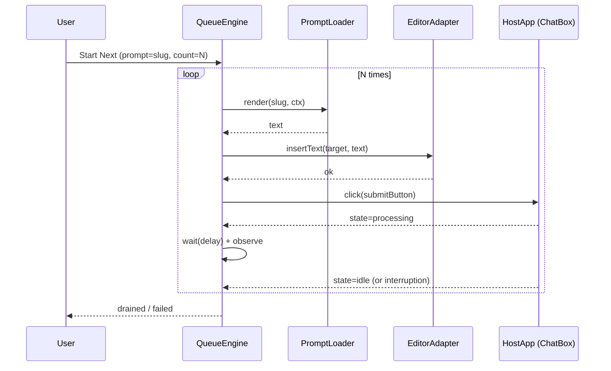

# 01 — Next-Automation Overview

**Date:** 2026-06-02
**Task:** T61

## Purpose

**Next mode** repeatedly injects the same prompt into the ChatBox and presses the host's submit button N times, observing for completion or interruption between iterations. It is the simplest queue consumer; **Plan mode** (Step 14) reuses the same engine with a different prompt template.

## Sequence (one iteration)

## Required host wiring

| Host concern | Spec reference |
|--------------|----------------|
| ChatBox target | `06-injection-contract/01-target-resolution.md` |
| Submit button | `02-host-submit-button.md` (this folder) |
| Busy/idle signal | `04-interruption-detection.md` |
| Cancel surface | `05-cancel.md` |

## Out of scope

- Streaming response parsing.
- Cost/credit tracking (consumer-level concern).
- Multi-tab coordination (single tab owns the queue).

## Acceptance

- [ ] The implementation satisfies the `01 — Next-Automation Overview` contract in this file and the folder-level acceptance target: NextLoop submission, disabled-button handling, interruption, and cancellation behavior is deterministic.
- [ ] Verification passes when `E2E-next-001..005` passes, and `node scripts/audit/check-acceptance.mjs --root=spec/2026-spec` reports this file has a machine-checkable acceptance contract.
